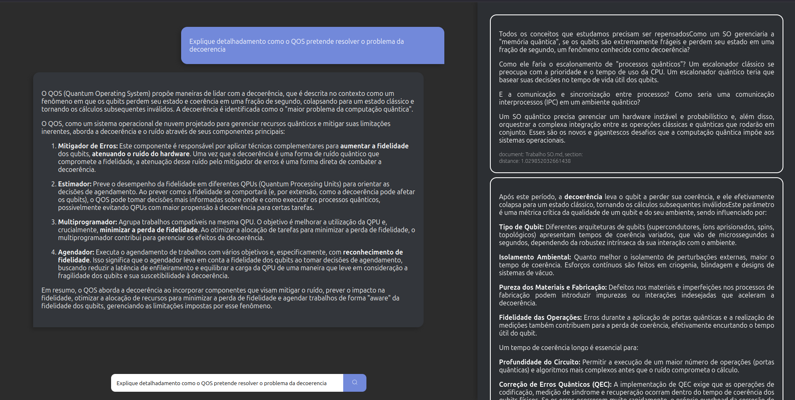

# Projeto RAG

Este projeto implementa um pipeline de Retrieval-Augmented Generation (RAG) usando um banco de dados vetorial para responder a perguntas com base em um conjunto de documentos.



## Tecnologias Utilizadas

### Backend

*   **Node.js:** Ambiente de execução para o servidor.
*   **Express:** Framework para a construção da API REST.
*   **LanceDB:** Banco de dados vetorial para armazenar e consultar os embeddings dos documentos.
*   **@google/genai:** SDK para utilizar os modelos de linguagem do Google (Gemini).
*   **@xenova/transformers:** Biblioteca para gerar os embeddings dos textos.

### Frontend

*   **React:** Biblioteca para a construção da interface de usuário.
*   **Vite:** Ferramenta de build para o desenvolvimento frontend.
*   **Styled-Components:** Biblioteca para estilização dos componentes React.

## Instruções para Instalação e Execução

### Pré-requisitos

*   Node.js (versão 20 ou superior)
*   npm

### Backend

1.  Navegue até o diretório `backend`:
    ```bash
    cd backend
    ```
2.  Instale as dependências:
    ```bash
    npm install
    ```
3. Crie um arquivo `.env` na raiz do diretório `backend` e adicione sua chave da API do Google:
    ```
    GOOGLE_API_KEY=SUA_CHAVE_API
    ```
4.  Execute o servidor:
    ```bash
    npm start
    ```
O servidor estará rodando em `http://localhost:3000`.

### Frontend

1.  Navegue até o diretório `frontend`:
    ```bash
    cd frontend
    ```
2.  Instale as dependências:
    ```bash
    npm install
    ```
3.  Execute o cliente de desenvolvimento:
    ```bash
    npm run dev
    ```
A aplicação estará disponível em `http://localhost:5173`.

## Adicionando Documentos ao Banco de Dados

Para adicionar novos documentos ao banco de dados vetorial, siga os passos abaixo:

1. **Coloque os documentos no diretório correto**:
   - Adicione os arquivos de texto ou Markdown que deseja processar no diretório `backend/docs/`.

2. **Execute o script para processar os documentos**:
   - Navegue até o diretório `backend`:
   - Execute o script `buld_db.js` para processar os documentos e adicionar os embeddings ao banco de dados:
     ```bash
     node rag_module/buld_db.js
     ```

4. **Confirme os dados no banco**:
   - Após a execução do script, os novos documentos estarão disponíveis no banco de dados vetorial localizado em `backend/vector_db/chunks.lance/`.

